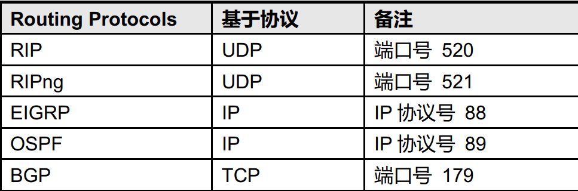

# IP Routing

[TOC]

## IP路由表

+ 路由条目包含如下信息:
  + 路由前缀 (目标地址)
  + 路由信息来源 (静态,OSPF,EIGRP,BGP)
  + 出接口或下一跳
+ 管理距离(AD)
  + 
+ 端口号
  + 

### ICMP重定向

+ 应用场景
  + 当网络设备发下发送给自己的数据包，下一跳地址和发送源地址在同一个子网时，就会回复一个icmp redirect报文，用于向发送源设备指出存在一个更加优化的路由。当源设备接收到这个icmp redirect报文后，后续数据包就会直接发送给新的下一跳。
  + 通常是由于路由设置不当,或网络设计不当造成的,建议关闭,关闭命令如下
  
    ```shell
      int vlan xx
       no ip redirect
    ``` 
### 有类路由和无类路由查找方式

+ ip classless按照逐位执行最长匹配
+ 有类路由(no ip classless 且关闭 ip cef)
  + 如果路由表中有主类路由,则再去找子网
  + 即使有默认路由,也要先查找本地是否存在主类路由

## IGP路由协议

### RIP


### EIGRP

### OSPF

