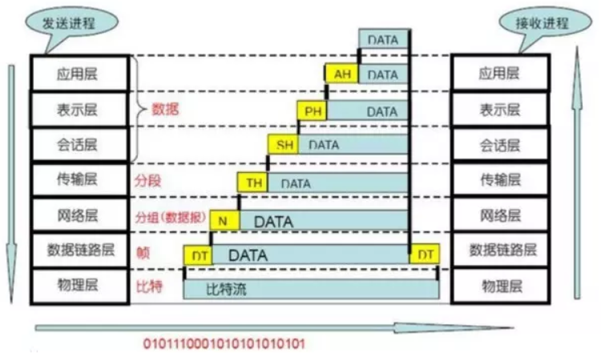
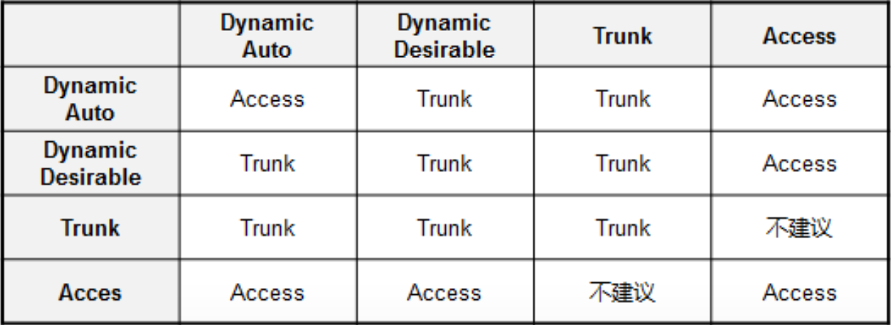
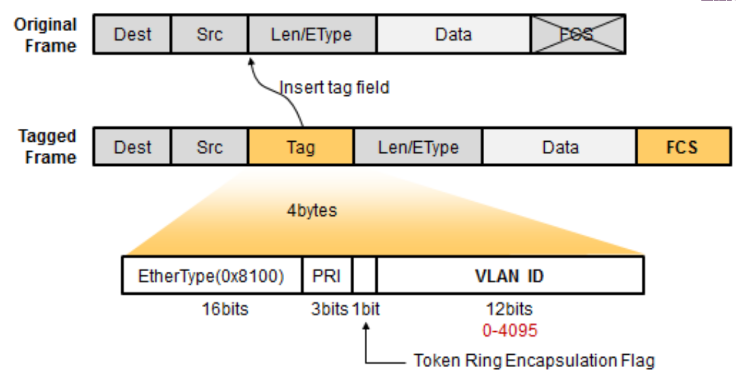
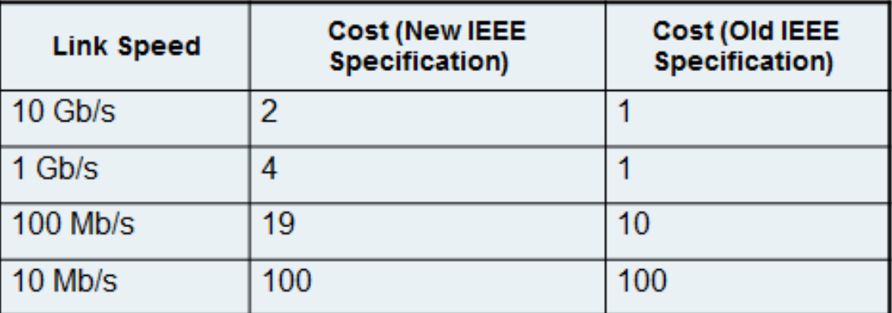
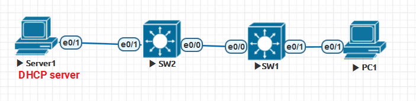

# 交换

[TOC]

## 基础知识

### OSI七层模型

1. 物理层
2. 数据连接层
3. 网络层
4. 传输层
5. 会话层
6. 表示层
7. 应用层



### MAC表
  
+ IP数据报文封装格式RFC894,通常称为EthernetII
+ `show mac address-table`
+ `clear mac address-table`
+ 绑定mac地址到一个端口 `Switch(config)# mac address-table static 机器MAC VLAN 接口`
  + 绑定MAC到端口,并不能阻止端口学到动态mac,目前没啥用
  + 路由器上更改端口MAC`L3(config-if)#mac-address  aabb.cc00.0201`
+ MAC地址共48位,前24位统一管理,后24位厂商分配
  + 47位I/G位
    + 0:设备MAC地址
    + 1:以太网中的广播或组播地址
  + 46位G/L位
    + 0:全球统一管理地址
    + 1:本地管理地址

### Ethernet帧

1. Preamble
2. Type
    1. 0800 IP
    2. 0806 ARP
    3. 0835 RARP
    4. 8137 IPX/SPX
    5. 8100 802.1Q virtual vlan
3. Data (46-1500字节)接口下设置MTU,一般不允许,`IP MTU`指的是报文的大小
4. FCS(校验结果)
5. 在wireshark中EthernetII帧带以下信息
    1. Source MAC
    2. Destination MAC
    3. Type: 0x800 IPV4

### 二层交换

#### VLAN

1. VLAN的作用: 隔离广播域, 不同的VALN为不同的广播域
2. 不同的VLAN需要通过三层设备进行相互通信
3. VLAN工作于二层(数据链路层,依靠MAC地址通信)
4. VLAN基于端口

#### 思科VLAN通信原理

1. access口VLAN帧处理过程
    1. access口收到二层数据帧
        1. 判断数据帧是否有VLAN tag
            1. 没有tag,标记上access口的默认VLAN(PVID)
            2. 如果有tag,则比较VLAN tag和端口的PVID是否一致,一致则进行下一步处理,否则丢弃
            3. 交换机根据帧的目的MAC地址和VLAN ID查找VLAN信息,决定从哪个端口把帧发送出去 (VLAN ID不同于VLAN Tag)
    2. access口发送二层数据帧
        1. 当数据帧从access端口发出时,交换机先剥离帧的VLAN Tag,然后再发送出去
2. Trunk口处理VLAN帧的过程
    1. Trunk口收到数据帧
        1. 如果没有VLAN Tag,则打上该Trunk的PVID(native VLAN),再转发到PVID对应的端口
        2. 如果有VLAN Tag,判断该Trunk口是否允许该VLAN的数据帧进入,不允许则丢弃,允许则判断该VLANID与该Trunk端口的PVID是否相同,相同则去掉LVAN标记后转发,不同则直接转发
    2. Trunk口发送数据帧
        1. 将要发送的数据帧的VLAN Tag与自己的PVID进行比较
            1. 如与PVID不同,则直接发送
            2. 如与PVID相同,则去掉后发送
3. 数据帧从Hybrid端开发出时,交换机判断VLAN在本端口的属性是Untag还是Tag,如果是untag,先剥离帧的VLAN Tag再发送,如果是tag,直接发送帧
4. 终端设备发送和接收时是不带VLAN TAG的
5. VLAN tag只有在trunk口,或路由器被802.1Q封装的子接口才能被wireshark捕获VLAN ID信息

#### Protect端口

1. 配置`SW1(config-if)#switchport protected`
2. protect端口虽然在同一VLAN,但彼此无法通信
3. protect端口只能和unprotect端口互相通信,端口默认在unprotect状态

#### Trunk端口

1. 封装形式
    1. ISL思科已经不用
    2. 802.1Q
        1. 默认允许VLAN1-4096
2. 链路聚集模式
    1. trunk
    2. Nonegotiate: 邻居必须是Trunk,不发送DTP帧
    3. Desirable: 主动尝试成为trunk,端口默认模式,发送DTP帧
    4. Auto
    5. Access
   
3. 802.1Q帧格式
   
   1. EtherType 0x8100即为802.1Q
   2. PRI,3bits优先级,0-7,值越大越优先
   3. CFI,1bit,表示MAC地址是否为经典格式
4. Native VLAN
    1. native vlan不打标签
    2. navtive VLAN两端必须匹配,Cisco在trunk口上打标
       1.access口碰到带标签的数据, 如果VLAN标签一致,就剥除VLAN头部,如果不一致,就丢弃
    3. 默认native VLAN是VLAN 1
    4. 配置命令`switchprot trunk native vlan xxx`
    5. 检测命令`show interface trunk`
5. VLAN范围
    1. 0,4095保留
    2. 1,cisco默认vlan
    3. 2-1001 VLAN
    4. 1002-1005 FDDI和TokenRing
    5. 1006-4094,只能为Ethernet使用,扩展VLAN
6. Trunk配置

    ```shell

    switchport trunk encapsulation dot1q
    switchport mode trunk {auto|desirable|dynamic}
    !关闭DTP
    switchport nonegotiate
    switchport trunk allow vlan 10,20

    !switchport trunk allow vlan add/remove ?
    ```
7. 最佳实践
+ 不使用端口
  + 关闭
  + 划为ACCESS
  + 划到不使用VLAN
  + 不使用端口的Native VLAN配置为一个未使用的VLAN
+ Trunk
  + trunk mode on参数配置Trunk端口,禁用Trunk协商
  + 将Trunk端口native VLAN配置为一个未使用的VLAN
  + 配置Trunk端口的允许VLAN 列表
  + Native VLAN 打标记 VLAN dot1q tag native

#### MTU问题

+ CISCO IOS上，interfacex接口模式下·
  + `MTU？`指的是二层的MTU，这是接口MTU，指的是不包含二层帧头的、Payload的MTU，这个MTU值一般是不能手工修改的，默认是1500字节。如此一来CISCO路由器支持的二层数据帧最大值就是1500的payload加上二层帧头及二层FCS：目的mac6字节+源mac6字节+类型字段2字节+FCS4字节，所以总的就是{==1518==}字节。
  + `Ip mtu？`指的是三层的MTIJ这个值可以手工修改但是最大值必须小于接口的二层MTU值也就是1500。这个MTU指的是三层IP包的总大小，如果接口发出的包大于这个接口的ipmtu，那么这个IP包将被分片

#### VTP

1. VTP三种模式
    1. server
    2. client
    3. transparent
    4. Server模式
        1. 可以创建VLAN
        2. 可以修改VLAN
        3. 可以删除VLAN
        4. 发送/转发信息
        5. 同步
        6. VLAN存储于NVRAM
        7. 思科交换机默认是Server模式
    5. Client模式
        1. 不能创建,修改,删除
        2. 发送/转发信息
        3. 同步
        4. 不保存于NVRAM
    6. Transparent模式
        1. 可以创建VLAN
        2. 可以修改VLAN
        3. 可以删除VLAN
        4. 发送/转发信息
        5. 不同步/不始发
        6. VLAN信息存储于NVRAM
2. VTP运作
    1. 通过组播地址0100-0CCC-CCCC在Trunk链路上发送VTP通告
    2. 每隔5分钟发送一次VTP通告
3. VTP配置

    ```shell
    vtp domain xxx
    vtp mode {server|client|transparent}
    vpt password xxx

    show vtp password
    show vtp status
    ```
4. VTP注意点
    1. VTP client版本高于server的时候, 有可能将server的VLAN信息覆盖掉, 需要先将VTP mode改为transparent
    2. vtp purning默认是打开的在新的IOS上
    3. `show int trunk`可以查看trunk上允许的vlan

### Private VLAN

+ 端口类型
+ Isolated
  + Communicates with only promiscuousports
+ Promiscuous
  + Communicates with all Other ports
+ Community
  + Communicates with other members Of community and promiscuousports
+ 参考红茶三杯的switching.pdf

### Spanning Tree

1. 生成树协议
   |Protocol| -| -|Describle|
   | -------| -|-|--------|
   |STP(PVST)|Public|802.1D|-|
   |PSVS+|Cisco Private|-|Protfast,uplinkfast,backbonefast|
   |RSTP|Pubic|802.1W|集成pvst的功能并公有化|
   |MST|Public|802.1S|-|
2. 参数
    1. 网桥ID
        1. 缺省32768,范围0-65535,越小越好
    2. 端口ID
        1. 缺省128,范围0-255,越小越好
    3. 根路径开销
   

#### spanning tree protocol-STP-802.1D

+ 影响STP的几个因素
  + 优先级
  + 根ID
  + 路径开销
  + 网桥ID
  + 端口ID
+ STP采用四部来解决二层环路
  + 在一个交换网络中选举root bridge
  + 在每个非根桥上选举一个根端口
  + 为每段网络连接选举一个指定端口
  + 阻塞非指定端口
+ 选举规则
  + 最低的根桥ID
  + 到根桥ID最低的路径成本
  + 最低的**发送者网桥ID**,即对端接口设备的网桥ID,越小越优先
  + 最低的**发送者端口ID**
  
#### STP端口状态

1. 计时器
    1. hello time: 2s
    2. 转发延迟时间 15s
    3. 最大存活周期 20s
    4. 阻塞到转发通常要30-50s(默认50s)
2. STP状态
    1. disable,不收发任何报文
    2. blocking,不接收不转发帧,接收但不转发BPDU,不学习MAC
    3. listening, 不接收不转发帧,接收且发送BPDU,不学习MAC
    4. learning, 不接收不转发帧,接收且转发BPDU,学习MAC
    5. forwarding, 接收且转发帧,接收且转发BPDU,学习MAC
3. 交换机端口up/down会产生TCN,TCN会泛洪网络,可设置Portfast防止产生过多的TCN

#### Spanning-Tree配置

+ 全局开启`spanning-tree portfast default`
+ trunk接口下如配置`spanning-tree portfast trunk`通常用于接口接了支持trunk的服务器
+ `switchport mode host`将指定接口mode设为access并且开启portfast特性
+ `spanning-tree portfast bpduguard default`接口激活bpduguard
+ err-disable的默认时间是300s
+ 另外两个特性是`spanning-tree bpdufilter`和`spanning-tree uplinkFast`
+ uplinkfast不能在根桥交换机上配置, 可以在末梢交换机或接入层交换机配置
  + 配置uplinkfast的交换机的根桥优先级会增加(32768->49152),以确保改交换机不会成为root
  + 交换机的所有端口的默认cost会增加到3000
+ `switch(config-if)#spanning-tree guard root`通常用于ISP放在客户设备成为root,通常在接口下配置
  + 查看命令`show spanning-tree inconsistentports`
+ `spanning-tree loopguard`防止出现单向链路故障
  + loopguard和rootguard不能同时启用
  + loopguard只可以在非指定端口上启用
+ UDLD单向链路检测

#### PVST+

+ PerVLAN生成一棵生成树
+ `spanning-tree vlan-id`激活特定vlan的STP,可以no掉
+ `spanning-tree vlan vlan-id priority pri`配置优先级
+ `spanning-tree vlan vlan-id root {primary|secondary}`设置主,次根
+ 接口下命令如下:
  + `spannig-tree [vlan vlan-id] cost xxx`
  + `spanning-tree [vlan vlan-id] port-priority xxx` IOS默认128
  + `spanning-tree [vlan vlan-id] hello-time xxx`
  + `spanning-tree [vlan vlan-id] forward-time xxx`
  + `spanning-tree [vlan vlan-id] mag-age xxx`

#### RSTP(802.1W)

1. 端口状态
   1. 丢弃
   2. 学习
   3. 转发
2. 端口角色
   1. 根端口
   2. 指定端口
   3. 替代端口
   4. 备份端口
   5. 禁用端口
3. RSTP收敛过程中,耗费的时间仅仅是BPDU从Root泛洪到网络末端的时间,不受任何Timer的限制,直接绕过两个转发时间.因此收敛速度更快
4. 配置RSTP模式 `(config)#spanning-tree mode ?`

### 三层交换

#### CAM和TCAM

1. CAM: content addressable memory table内容可寻址内存
   1. 查表是目的MAC与CAM表中的MAC需要完全匹配
2. TCAM是路由模块或者路由器用于三层转发是所查的表
   1. **最长匹配原则**

#### VLAN间路由

##### 单臂路由

1. 配置方法

```shell
int f0/0
no shut

int e0/0.10
encapsulation dot1q 10
ip add 192.168.10.254 255.255.255.0
no shut

inte0/0.20
encapsulation dot1q 20
ip add 192.168.20.254 255.255.255.0
no shut

```

##### SVI (Switch virtual interfaces)

+ 二层接口:access模式, trunk模式
+ 三层接口: 路由接口(no switchport或者routed port), SVI接口

#### 三层交换机的基本配置

+ 配置

```shell

ip routing
!开启三层交换机的路由功能

vlan10
name class
!创建vlan

int vlan 10
ip address 192.168.10.254 255.255.255.0
no shut
!配置SVI

int fa0/1
no switchport
ip add 192.168.255.1 255.255.255.0
no shut
!配置三层接口

ip route 0.0.0.0 0.0.0.0 192.168.255.2
!配置静态路由
```

### 网关冗余技术

#### GLBP(Gateway load balance protocl)

1. 最多支持4台设备, 这些网关被称为AVF(active virtual forwarder)
2. GLBP自动管理虚拟MAC,这些功能由AVG(active virtual gateway实现)

```shell
SW4(config-if)#glbp 1 ?
  authentication  Authentication method
  client-cache    Client cache
  forwarder       Forwarder configuration
  ip              Enable group and set virtual IP address
  load-balancing  Load balancing method
  name            Redundancy name
  preempt         Overthrow lower priority designated routers
  priority        Priority level
  timers          Adjust GLBP timers
  weighting       Gateway weighting and tracking

SW4:
interface Vlan10
 ip address 10.1.1.252 255.255.255.0
 glbp 1 ip 10.1.1.254
 glbp 1 priority 120
 !优先级高的成为AVG
 glbp 1 preempt
 !开启抢占

SW3:
interface Vlan10
 ip address 10.1.1.253 255.255.255.0
 glbp 1 ip 10.1.1.254
 glbp 1 preempt
end


!查看命令

show GLBP

!load-balance的方式

SW4(config-if)#glbp 1 load-balancing ?
 !同一源MAC地址被分配到固定的AVG
  host-dependent  Load balance equally, source MAC determines forwarder choice
  !默认的load-balance的方式
  round-robin     Load balance equally using each forwarder in turn
  !配合GLBP 1 weight使用决定每台AVG所分担的负载
  weighted        Load balance in proportion to forwarder weighting

```

+ weighted扩展

```shell
interface Vlan10
 ip address 10.1.1.252 255.255.255.0
 glbp 1 ip 10.1.1.254
 glbp 1 priority 120
 glbp 1 load-balancing weighted
 ! 当weight低于85,则不在分担任何流量,只有流量再高于105,才会转发
 glbp 1 weighting 110 lower 85 upper 105
 ! track失败,weight减去一个值
 glbp 1 weighting track 10 decrement 10
 glbp 1 weighting track 20 decrement 20
```

#### HSRP(hot standby router protocol)

+ standby routers listen for hellos from active router, defaulting to a 3-second hello interval and 10-second dead interval
+ 虚拟MAC 0000.0C07.ACxx, xx代表十六进制的HSRP组
+ 支持明文或MD加密
+ 举例:

```shell
!设置HSRP track
track 13 interface Serial0/0.1 line-protocol
! Next, on Router R1, two HSRP groups are configured. R1 has a higher priority
! in group 21, with R2 having a higher priority in group 22. R1 is set to preempt
! in group 21, as well as to track interface s0/0.1 for both groups.
interface FastEthernet0/0
ip address 10.1.1.1 255.255.255.0
standby 21 ip 10.1.1.21
continues
standby 21 priority 105
standby 21 preempt
standby 21 track 13
standby 22 ip 10.1.1.22
standby 22 track 13

!debug命令
debug HSRP
```

+ track参考: [思科 Enhanced Object tracking](https://www.cisco.com/c/en/us/td/docs/ios-xml/ios/ipapp/configuration/15-mt/iap-15-mt-book/iap-eot.html)

#### VRRP(virtual router redundancy protocol)

+ VRRP 配置

  ```shell
    track 90 interface fa0/24 line-protocol
    inter vlan 10
    ip add 10.1.10.2 255.255.255.0
    vrrp 1 ip 10.1.10.1
    vrrp 1 priority 10
    vrrp 1 timer advertise msec 500
    vrrp 1 authentication md5 keystring xyz123
    vrrp track 90 decrement 20
  ```

#### 检测命令

`show standby brief`
`show sstandby

### Etherchannel

+ Etherchannel协议
  + PAgP 思科专有
  + LCAP IEEE802.3AD
+ PaGP的模式
  + On
  + Desirable
  + Auto
  + Off
+ 基本配置

+ 二层EtherChannel

```shell

int rang e0/1-2
switchport
switchport trunk encapsulation dot1q
switchport mode trunk
channel-protocol pagp/lacp !此命令在模拟器下会被拒绝
channel-group 1 mode descirable/on/auto

!查看命令
show etherchannel 1 summary
```

+ 三层EtherChannel

```shell

int rang e0/1-2
no switchport
no ip address
channel-group 1 mode descirable/on/auto
no shutdown

int port-channel 1
ip add 172.16.10.1 255.255.255.0
no sh

!查看命令
show etherchannel 1 summary
```

+ 配置port-channel load balance的类型 `port-channel load-balance ?`

### Port-security

+ 安全地址表项可以通过三种方式学到
  + 动态学习到(secure dynamic)
  + 手工在接口下配置(secure configured)
  + sticky MAC address(secure sticky)
+ 默认最大允许的安全MAC数量 1
+ 惩罚模式 shutdown,同时发送一个SNMP trap
+ 配置举例

  ```shell
    int fa0/1
    switchport
    switchport mode access
    swithcport access vlan 10
    switchport port-security
    switchport violation {protect|restrict|shutdown}
    switchport port-security maximum 2 vlan 10,20,30
    switchport port-secuirty maca-address xxxx [vlan id]

    switchport port-secuirty mac-address sticky
    switchport port-security aging type {absolute|inactivity}
    switchport port-security aging time xx(mins)

    !查看命令
    show port-scurity int e0/1
    show port-security  address

  ```

+ 被惩罚后的回复
  + 全局配置: err-disable recovery psecure-violation
  + 手工shut,no shut

### DHCP及DHCP Snooping

+ UDP协议,端口67及68
+ BootPC: 67(客户端端口号), BootPS:68(服务端端口号)
+ 四个包
  + DHCP discovery
  + DHCP offer
  + DHCP request
  + DHCP ACk
+ DHCP配置

```shell
  service dhcp

  ip dhcp excluded-address 10.1.1.1 10.1.1.10
  
  ip dhcp pool xxx
  network 10.1.1.0 255.255.255.0
  default-router 10.1.1.254

  !在SVI接口上配置DHCP server中继
  ip helper-address 10.1.1.1
```

+ 查看命令
  + `show ip dhcp database`
  + `show ip dhcp binding`
  + `show ip dhcp statis`
  + `debug dhcp detail`

+ dhcp手工绑定IP

```shell
ip dhcp pool WPRINTER1
   host 10.85.3.20 255.255.255.0
   hardware-address ac:3f:a4:7a:66:9e
```

#### DHCP snooping

+ 将连接合法DHCP服务器的接口配置为Trust,只有trust接口上收到来自DHCP Server的报文
+ 例子
+ 
  
配置

+ Server1

```shell
ip dhcp pool vlan10
 network 192.168.10.0 255.255.255.0
 default-router 192.168.10.254

interface Ethernet0/1
 ip address 192.168.100.1 255.255.255.0

no ip routing
ip default-gateway 192.168.100.254
```

+ SW2

```shell
vlan 10,100

interface Vlan10
 ip address 192.168.10.254 255.255.255.0
 ip helper-address 192.168.100.1
!
interface Vlan100
 ip address 192.168.100.254 255.255.255.0
!
interface Ethernet0/0
 switchport trunk encapsulation dot1q
 switchport mode trunk
!
interface Ethernet0/1
 switchport access vlan 100
```

+ SW1

```shell
vlan  10
ip dhcp snooping
ip dhcp snooping vlan 10

no ip dhcp snooping informaiton option
!不写入option82

interface Ethernet0/0
 switchport trunk encapsulation dot1q
 switchport mode trunk
 ip dhcp snooping trust
!在上联接口配置Snooping trusk

interface Ethernet0/1
 switchport access vlan 10
!

```

+ 还有一种解法就是在SW1上启用option82 `ip dhcp snooping informaiton option`,但是在SW2上要配置如下
  + `ip dhcp relay information trust_all`
  + 或者`interface vlan 10/ ip hdcp relay informatoin trusted`

+ 方法三:
  + SW1
    ```shell
    !不写入option82
    no ip dhcp snooping information option
    ip dhcp snooping

    interface Ethernet0/0
    switchport trunk encapsulation dot1q
    switchport mode trunk
    ip dhcp snooping trust
    !
    ```
  + SW2(核心上也开始IP dhcp snooping, 但是**不能开启**ip dhcp snooping vlan 10,100,否则客户端获取不到IP)
    ```shell
    ip dhcp snooping
    interface Ethernet0/0
    switchport trunk encapsulation dot1q
    switchport mode trunk
    ip dhcp snooping trust
    !
    interface Ethernet0/1
    switchport access vlan 100
    ip dhcp snooping trust
    !
    ```

+ **总结**
  + 启用DHCP Snooping可以在边界交换机的uplink上开启`ip dhcp snooping trust`,并且使用命令`no ip dhcp snooping informaiton option`关闭option82的发送
  + 或者边界交换机发送option82,但是在核心上开启`ip dhcp relay information trust_all`(不插入opiton82),或者vlan interface上设置`ip dhcp relay informatoin trusted`
  + 核心上可以开启`ip dhcp snooping`,连接DHCP和连接下游交换的的接口设置`ip dhcp snooping trust`, 但是**不能**开启`ip dhcp snooping vlan 10,100`
  + ip dhcp snooping端口速率限制`ip dhcp snooping limit rate ?`
  + 参考: 红茶三杯的switch.PDF page 104

### DAI (Dynamic ARP Inspection)

+ ARP基于广播
+ ARP相应报文无需确认即可直接发送
+ 没有确认机制
+ Invalid ARP
  + MAC地址全为零(windows主机),或者No completed(网络设备)
  + 产生的原因: 发送ARP Request后,为接收ARP Reply做准备
+ Gratuitous ARP: 用于IP冲突检测,sender IP和target IP一致
+ **DAI依赖于DHCP Snooping**
+ 基本配置
+ `ip ARP inspection vlan {vlan_ID|vlan_range}`
+ 接口配置`ip ARP inspection trust`
+ 接入层交换机配置

  ```shell
  ip arp inspection vlan 10
  int e0/0
  ip arp inpsenction trust
  ```

+ 手工添加DHCP Snooping绑定表项的命令,应用于静态IP的端口`ip dhcp snooping binding xxxx.xxxx.xxxx(MAC) vlan x ip-address interface gi1/0/1 expiry xxx`
+ 或者添加ARP ACL

```shell
arp access-list ccie
permit ip host 192.168.10.111 mac host xxxx.xxxx.xxxx
ip arp inspection filter ccie vlan 10
```

+ arp errdisable恢复

```shell
errdisable recovery cause arp-inspection
errdisable recovery interval 30
int e0/1
ip arp inspenction limit rate 10

```

